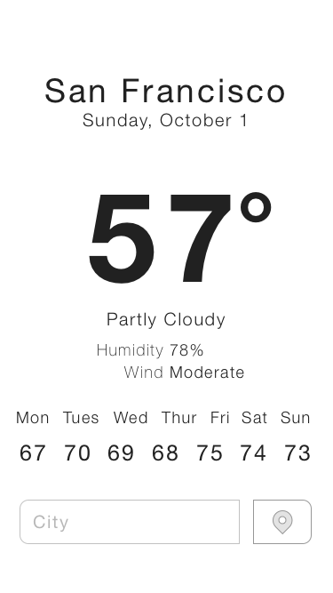
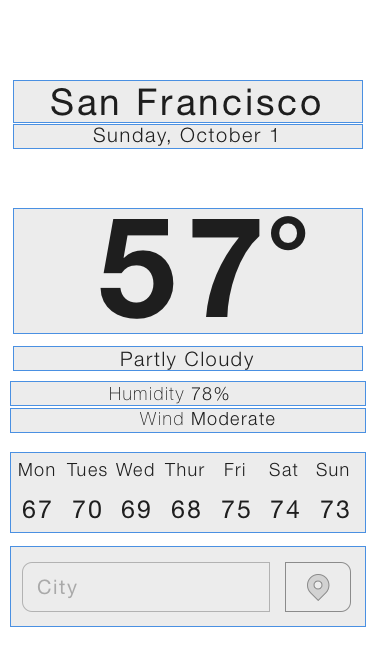

# React Native

Build for native with React using JavaScript!

- https://facebook.github.io/react-native/docs/getting-started.html

## Overview 

React Native creates a *truly native* projects that run on React. These are *not*
hybrid HTML apps. 

As native apps they make use of many of the built in UI objects. As such 
many of the HTML elements are replaced with a native equivalent. Even though
the elements are different they are still implemented in the same way. 

For example the following are not available. 

- div
- h1-6 
- input 

Here are some of the component/tags available via the 'react-native' package. 

- View
- Text
- ScrollView
- ListView
- Button
- Image
- ...

Import these from the `react-native` package like this: 

`import { Text, View } from 'react-native';`

Many global JavaScript methods like `fetch()` are available in React native also!

### Styles 

Styles are handled a little differently. You will want to use the styled component
strategy. That is place the styles within the component definition. 

You'll need to make a styleSheet object with. Create a new stylesheet as a JavaScript 
Object assigning style properties in camel case. Units are always points. React Native
only supports a subset of the available CSS style properties and some of the values 
differ. Be sure to consult the [docuementation](https://facebook.github.io/react-native/docs/style.html).

```
import { StyleSheet } from 'react-native'

const styles = StyleSheet.create({
    heading: {
        color: 'red',
        fontSize: 24
    }
});
```

Apply styles to any object like this: 

`<Text style={styles.heading}>Hello World!</Text>`


## General Debugging and logging

React Native is using the simulator but not generally running in a development
environment. Most the code is run via JS. This makes debugging a problem. 

In the simulator use command+d to open the menu. Choose: Debug JS Remotely. 
This will send console and error messages to Chrome. You'll need to open 
Chrome and open the console. 

Compilation errors will show in the simulator, while run time errors will
end up in the console. 

## Challenges

- Follow the React-Native [getting started guide](https://facebook.github.io/react-native/docs/getting-started.html)
    - Install React-Native and commandline tools. 
    - Create a new project and run it.
- React Native relies heavily on Flex Box for layout. Complete this tutorial. 
  - [Flex box froggy tutorial](http://flexboxfroggy.com)
- Use the the View and Text components to mock up the weather app.  
    - Look at the mock up images. Your job is to recreate this.  
    - You will need to use Flex box to set the layout. 
    
Your finished challenge should close to this. 



This is simple version shows generally how you might plan your layout. 



This is a more detailed version that shows how you might build this to get the 
layout to more accurately match the mock up. 


